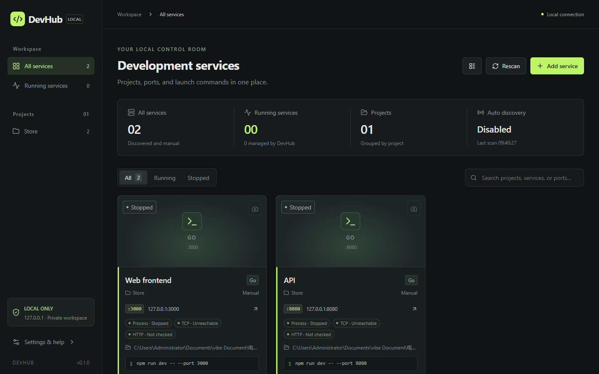

# DevHub

[English](README.md) · [中文](README.zh.md)

仓库：[github.com/Lcrro/DevhubX](https://github.com/Lcrro/DevhubX) · 当前版本 **[v0.2.0](https://github.com/Lcrro/DevhubX/releases/tag/v0.2.0)**

DevHub 是一个只在本机运行的开发服务工作台。它把项目目录、端口、启动命令、进程状态、日志和网页封面放在一起。**默认界面为英文**，可在设置中切换中文。

不需要账号、云服务或数据库服务器。前端打包进单个 Go 可执行文件。启动后打开 **http://127.0.0.1:4780**。



项目目标、开发路线和技术栈见 [`docs/project-overview.md`](docs/project-overview.md)。Issue 和 Pull Request 请提到本仓库。

## 功能

- **自动发现**：默认每 10 秒枚举当前用户的 TCP 监听进程；可关闭扫描、调整 5–300 秒间隔，并配置包含/排除目录、进程和端口。识别 `package.json`、`go.mod`、`pyproject.toml`、`Cargo.toml` 等。同一进程的多个端口会合并，可选择主网页，并显示命中原因。
- **项目工作台**：按项目分组，搜索名称、框架、路径或端口，筛选运行/停止。
- **启动与停止**：保存可信的本机启动命令；拒绝端口冲突。Windows 使用 PowerShell + Job Object，macOS/Linux 使用 `/bin/sh` + 进程组。
- **自动截图**：运行中的 HTTP 服务进入截图队列，使用本机 Chrome / Edge / Chromium。
- **状态与日志**：分别显示进程、TCP、HTTP；清理 ANSI / PowerShell CLIXML；支持搜索、暂停、复制、清空和导出。
- **本地持久化**：SQLite WAL 保存配置和日志，PNG 保存封面。
- **本机安全边界**：只监听 `127.0.0.1`，检查 Host/Origin/Fetch Metadata，写操作需要随机会话令牌。
- **备份与导入**：导出默认去掉日志、封面和密钥。导入前先备份数据库。
- **个性化**：深色/浅色、强调色、密度、卡片/列表、项目颜色图标排序。

## 快速开始

可从 [Releases](https://github.com/Lcrro/DevhubX/releases) 下载预编译文件，或自行构建。构建需要 **Go 1.26+、Node.js 22.12+、npm**。

```sh
git clone https://github.com/Lcrro/DevhubX.git
cd DevhubX
cd web
npm ci
npm run build
cd ..
go build -o dist/devhub ./cmd/devhub
./dist/devhub
```

Windows PowerShell：

```powershell
./scripts/build.ps1
./dist/devhub.exe
```

Linux / macOS：`sh scripts/build.sh`。

然后打开 [http://127.0.0.1:4780](http://127.0.0.1:4780)。

完整参数、开发方式和已知边界见 [英文 README](README.md)。
